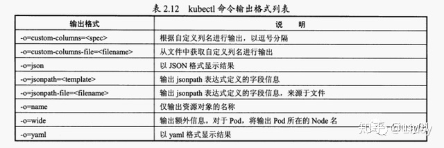
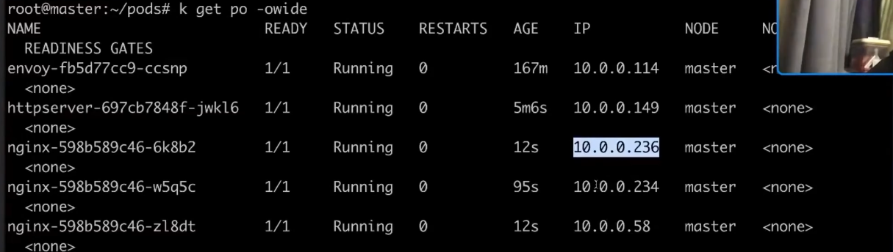
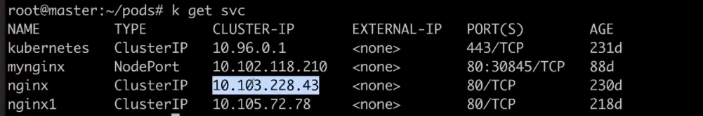
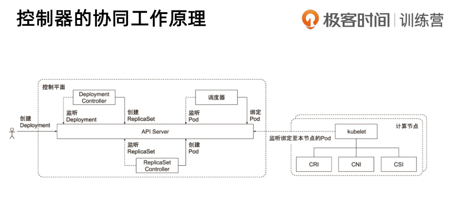

### 预习：
kubernetes 一个开源容器编排系统  服务网格
安装本地k8s环境： https://pouncing-waterfall-7c4.notion.site/k8s-ccd8ac1710d24af98e0c33489fae722c

希望能安装好docker和k8s的同学，可以参考我放在github上安装环境的文档，选一种适合你的：https://github.com/cncamp/101

go语言基础示例代码： https://github.com/cncamp/golang


### 安装k8s
[installk8s](./installk8s.md)  
[installk8s-network](./installk8s.md#network)  
[installk8s-firewall](./installk8s.md#firewall)  


### 第一天作业：
思考题：容器的缺点
实验题cgroup使用实例-使用memory进行限制

### 第二天作业：
搭建环境测试通过static pod的方式启动应用

### 思考：
为什么container内部的程序运行只会找container文件系统的文件。

[进入docker容器中查看文件夹_详解挂载运行的docker容器中如何挂载文件系统](https://blog.csdn.net/weixin_39990138/article/details/112032348)

[Docker联合文件系统](https://www.cnblogs.com/nyh-blog/articles/11988406.html)

etcd redis
kuber admin

多进程调用的资源控制：
MVCC

springcloud: [微服务框架的介绍](https://blog.csdn.net/polo2044/article/details/95319059)

JC机制： 垃圾回收

12factory

kebernetes admin搭建kebernetes

containerd

OpenStack会逐渐被K8S取代
    AS PAS SAS

边缘计算： 华为一些公司用的技术
K3S 是 K8S的弱化版本。

[服务网格（Service Mesh）与Kubernetes的服务发现](https://blog.csdn.net/weixin_45412507/article/details/96241079)


### K8S命令：
[k8s通过yaml创建pod_K8S基本使用](https://blog.csdn.net/weixin_42518709/article/details/112434245)

根据ymal创建一个pod： 
```
kubectl create -f httpserver.yaml
打印Verbose Log:
kubectl create -f httpserver.yaml -v 9

kubectl apply -f nginx.yaml -v 9

create会把整个文件读出来，通过post方法发到apiserver。
apply会去apiserver对比当前存在的这个对象的版本和本地通过-f传给apiserver的版本有哪些差异，kubectl会对差异做一个diff,找出差异然后crate一个merge-patch,然后发不同的部分给apiserver。
```

#### kubelet
kubelet启动时可以设置 kubeconfig=\<configfile-path\>  
比如：
/usr/bin/kubelet --bootstrap-kubeconfig=/etc/kubernetes/bootstrap-kubelet.conf --kubeconfig=/etc/kubernetes/kubelet.conf --config=/var/lib/kubelet/config.yaml --network-plugin=cni --pod-infra-container-image=registry.aliyuncs.com/google_containers/pause:3.5

里面可以设置 staticPodPath: /etc/kubernetes/manifests 文件夹，里面放置pod配置文件来给kubelet来加载pod。比如
etcd.ymal kube-apiserver.yaml kube-controller-manager.ymal kube-scheduler.ymal 来自[https://github.com/kubernetes](https://github.com/kubernetes/kubernetes/tree/master/test/fixtures/doc-yaml/admin/high-availability)


#### 查看pod:
```
kubectl get po
查看所有namespace的pod:
kubectl get pod --all-namespaces
查看制定namespace的pod:
kubectl get pod -n kube-system
查看所有Pod:
kubectl get pods -A
以wide格式显示：
kubectl get po -owide
kubectl get po -o=wide
以yaml格式显示：
kubectl get po -o=ymal
显示label:
kubectl get po --show-labels
指定label查询：
kubectl get po -l run=nginx
查看所有pod:
kubectl get pods -A


查看特定命名空间的Pod Namespace为liusy下的Pod
kubectl get pods -n liusy
或
kubectl get pods --namespace liusy
```


#### 监听pod变化
kubectl get po -w

#### 删除一个pod
```
kubectl delete po <pod-name>
或如果使用yaml文件创建，也可以使用yaml文件删除：
kubectl delete -f nginx-service.yaml
```

#### 给pod添加一个annotations:
```
kubectl annotate po <pod-name> string=string
```

#### 更新pod-提高高可用，冗余部署，创建3个nginx实例：
kubectl scale deploy nginx --replicas=3


#### kubernetes提供了一个对象:Service，避免用户直接指定访问某一个nginx对象,从而达到负载均衡，得到高可用的一个保证。
service用来做负载均衡的对象


查看service:
```
kubectl get svc
或
kubectl get service
```

编辑service:
```
kubectl edit svc <service-name>
```

监控service:
```
kubecto get svc -w -v 9
```




#### 查看Note
```
kubectl note -oyaml
```


#### deployment
deployment的yaml文件里的kind为deployment

#### 创建/更新pod成deployment，并形成一个service
```
kubectl scale deploy nginx ---replicas=<num>
```

#### 获取deployment
```
kubectl get deploy
```

#### 编辑deploypent
```
kubectl edit deploy <deploy-name>
或更新
kubectl scale deploy <deploy-name> --replicas=<num>
```

#### 查看deploy发生过什么
```
kubectl describe deploy <deploy-name>
或查看deployment详细的信息
kubectl get deploy <deploy-name> -oymal
```

#### 查看ReplicaSet
通过deployment里的templat建一个hash值。以这个hash值建立replicaSet
```
kubectl get rs <replicaSet>
kubectl get rs <replicaSet> -oymal
kubectl descript rs <replicaSet>
```

#### 查看某个资源的详细信息
```
kubectl describe 资源类型 资源名称
或
kubectl describe 资源类型/资源名称
```

#### 查看某个资源的日志
```
kubectl logs 资源类型 资源名称
或
kubectl logs 资源类型/资源名称
```

#### 跟踪查看容器的日志，相当于tail -f命令
```
kubectl logs -f <pod-name> -c <container-name>
```

#### 删除拥有某个Label的资源
```
kubectl delete 资源类型 -l name=<label-name>
```
